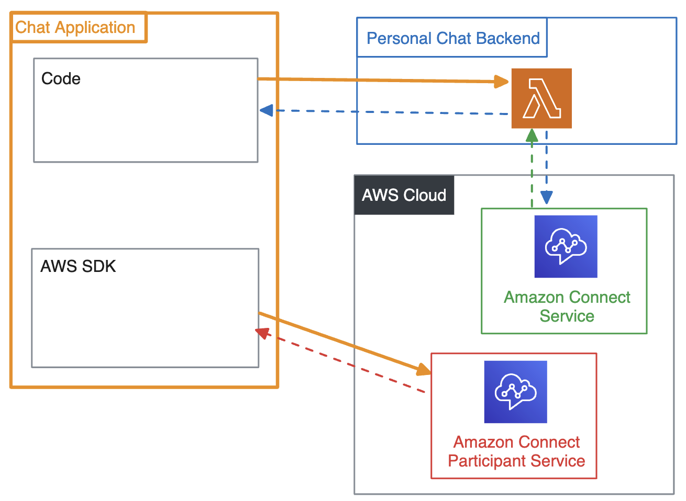
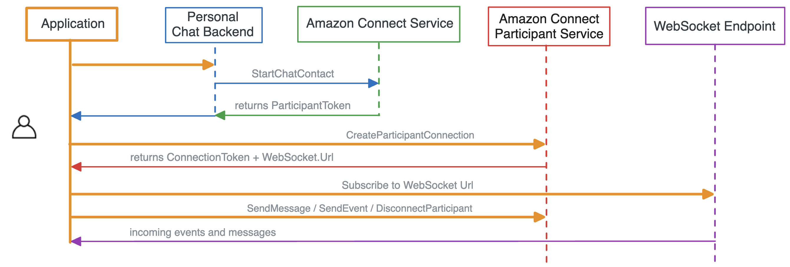

# Building a Chat application for Amazon Connect with AWS SDK

## Overview

This guide will walk through how to use a personal chat backend and Amazon Connect public APIs to build a chat application, using the AWS SDK.



## Sequence of API Calls



1. **Initiate a chat:** make request to your personal chat backend, which calls the [StartChatContact](https://docs.aws.amazon.com/connect/latest/APIReference/API_StartChatContact.html) SigV4 API
2. **Connect to a chat session:** make a [CreateParticipantConnection](https://docs.aws.amazon.com/connect-participant/latest/APIReference/API_CreateParticipantConnection.html) request with AWS SDK
3. **Subscribe to websocket:** use the ConnectionToken and WebSocket URL provided
4. **Send chat events:** make requests to [Amazon Connect Participant Service](https://docs.aws.amazon.com/connect-participant/latest/APIReference/API_Operations.html) APIs with AWS SDK

## Prerequisites

1. Create an Amazon Connect Instance [[_guide_](https://docs.aws.amazon.com/connect/latest/adminguide/amazon-connect-instances.html)]
2. Create an Amazon Connect Contact Flow, ready to receive chat contacts. [[_guide_](https://docs.aws.amazon.com/connect/latest/adminguide/chat.html)]

    * Find the instanceId [[_guide_](https://docs.aws.amazon.com/connect/latest/adminguide/find-instance-arn.html)]
    * Find the contactFlowId for the "_Sample Inbound Flow (First Contact)_“ [[_guide_](https://docs.aws.amazon.com/connect/latest/adminguide/find-contact-flow-id.html)]

1. Deploy a custom Amazon Connect Chat backend. [[sample CloudFormation stack](https://github.com/amazon-connect/amazon-connect-chat-ui-examples/tree/master/cloudformationTemplates/startChatContactAPI)]

## High-Level guide

### Install SDK Libraries

We recommend using [ChatJS](https://www.npmjs.com/package/amazon-connect-chatjs), a JavaScript library with light wrapper around the AWS-SDK. This has built in logic to handle WebSocket connections and retry logic:

```js
// ChatJS example

import "amazon-connect-chatjs"; 

// imports the global "connect" values
connect.ChatSession.create({ /* ... */ });
```

Alternatively, here is sample code for using the [v3 JavaScript AWS SDK](https://docs.aws.amazon.com/AWSJavaScriptSDK/v3/latest/Package/-aws-sdk-client-connectparticipant/) directly. This allows full customization, but requires your own logic to handle WebSocket connections. 

```js
// AWS SDK v3 (JavaScript) example

import { ConnectParticipantClient, CreateParticipantConnectionCommand } from "@aws-sdk/client-connectparticipant"; // v3.x.x

// Create a ConnectParticipantClient instance
const client = new ConnectParticipantClient({ region: REGION });
```

### Initiate a chat

Since [StartChatContact](https://docs.aws.amazon.com/connect/latest/APIReference/API_StartChatContact.html) is a [SigV4 API](https://docs.aws.amazon.com/IAM/latest/UserGuide/reference_aws-signing.html), your application will first make a call to your personal chat backend. If you deploy the [sample startChatContactAPI CloudFormation](https://github.com/amazon-connect/amazon-connect-chat-ui-examples/tree/master/cloudformationTemplates/startChatContactAPI) stack, make a request to the API Gateway endpoint. This will return the ParticipantToken used for the rest of the chat session. 

```js
// Your chat application
// Example code making request to personal chat backend

const ENDPOINT_URL = "<url-to-personal-chat-backend>";

const startChatRequestBody = {
   ContactFlowId: "<REPLACE_ME>",
   InstanceId: "<REPLACE_ME>",
   ParticipantDetails: {
         DisplayName: "John Doe"
   }
};

fetch(ENDPOINT_URL, {
  "POST",
  headers: { 'Content-Type': 'application/json' },
  body: JSON.stringify(startChatRequestBody), 
})
  .then(response => response.json())
  .then(data => {
    console.log('Lambda response:', data); // { "ContactId": "string", "ContinuedFromContactId": "string", "ParticipantId": "string", "ParticipantToken": "string" }
  })
  .catch(error => {
    console.error('API error:', error);
  });
```

Your personal chat backend can use the AWS SDK to make the StartChatContact request, and return the response to your chat application. Here is an example lambda function for this use case:

```js
// AWS SDK v3 (JavaScript) example
// Lambda code to make StartChatContact request

const { ConnectClient, StartChatContactCommand } = require("@aws-sdk/client-connect");
const client = new ConnectClient({ region: process.env.REGION });

exports.handler = (event, context, callback) => {
    const body = JSON.parse(event["body"]);
    const startChatRequest = {
        "InstanceId": body["InstanceId"],
        "ContactFlowId": body["ContactFlowId"],
        "ParticipantDetails": {
            "DisplayName": body["ParticipantDetails"]["DisplayName"]
        },
    };
 
    const command = new StartChatContactCommand(startChatRequest);

    try {
        const response = await client.send(command);
        
        console.log("Start chat succeeded with the response: " + JSON.stringify(response.data));
        callback({ 200, body: JSON.stringify(response.data) }) // `{ "`[ContactId](https://docs.aws.amazon.com/connect/latest/APIReference/API_StartChatContact.html#connect-StartChatContact-response-ContactId)`": "`***string***`", "`[ContinuedFromContactId](https://docs.aws.amazon.com/connect/latest/APIReference/API_StartChatContact.html#connect-StartChatContact-response-ContinuedFromContactId)`": "`***string***`", "`[ParticipantId](https://docs.aws.amazon.com/connect/latest/APIReference/API_StartChatContact.html#connect-StartChatContact-response-ParticipantId)`": "`***string***`", "`[ParticipantToken](https://docs.aws.amazon.com/connect/latest/APIReference/API_StartChatContact.html#connect-StartChatContact-response-ParticipantToken)`": "`***string***`" }`
    } catch (error) {
        console.error("Error starting chat contact:", error);
    }
};
```

```js
// AWS SDK v2 (JavaScript) example 
// Lambda code to make StartChatContact request

var AWS = require('aws-sdk');
AWS.config.update({region: process.env.REGION});
var client = new AWS.Connect();

exports.handler = (event, context, callback) => {
    const body = JSON.parse(event["body"]);
    const startChatRequest = {
        "InstanceId": body["ContactFlowId"],
        "ContactFlowId": body["InstanceId"],
        "ParticipantDetails": {
            "DisplayName": body["ParticipantDetails"]["DisplayName"]
        },
    };

    client.startChatContact(startChatRequest, function(err, data) {
        if (err) {
            console.log("Error starting the chat.", err);
        } else {
            console.log("Start chat succeeded with the response: " + JSON.stringify(data));
           callback(null, { 200, body: JSON.stringify(data) });
        }
    });
};
```

### Connect to a chat session

Connect to the ongoing chat session using the [CreateParticipantConnection](https://docs.aws.amazon.com/connect-participant/latest/APIReference/API_CreateParticipantConnection.html) public API, and pass in the values of the StartChatContact response. This returns ConnectionToken and WebSocket URL

```js
// ChatJS example

import "amazon-connect-chatjs"; 

const chatSession = connect.ChatSession.create({
  chatDetails: { 
    contactId: "<REPLACE_ME>",
    participantId: "<REPLACE_ME>",
    participantToken: "<REPLACE_ME>",
  },
  options: { // optional
    region: REGION, // optional
  },
  type: "CUSTOMER", 
});

await chatSession.connect();
```

```js
// AWS SDK v3 (JavaScript) example
import { ConnectParticipantClient, CreateParticipantConnectionCommand } from "@aws-sdk/client-connectparticipant";// v3.x.x

const client = new ConnectParticipantClient(config);
const input = { // CreateParticipantConnectionRequest
  Type: [ // ConnectionTypeList
    "WEBSOCKET" || "CONNECTION_CREDENTIALS",
  ],
  ParticipantToken: "STRING_VALUE", // required
  ConnectParticipant: true || false,
};
const command = new CreateParticipantConnectionCommand(input);
const response = await client.send(command);
// { // CreateParticipantConnectionResponse
//   Websocket: { // Websocket
//     Url: "STRING_VALUE",
//     ConnectionExpiry: "STRING_VALUE",
//   },
//   ConnectionCredentials: { // ConnectionCredentials
//     ConnectionToken: "STRING_VALUE",
//     Expiry: "STRING_VALUE",
//   },
// };

// TODO - add logic for websocket connection
```

### Send chat events

Make calls to the [Amazon Connect Participant Service](https://docs.aws.amazon.com/connect-participant/latest/APIReference/API_Operations.html) APIs for the ongoing chat, using the ConnectionToken.

####  Sending Messages

Send a message using the [SendMessage](https://docs.aws.amazon.com/connect-participant/latest/APIReference/API_SendMessage.html) API

```js
// ChatJS example

import "amazon-connect-chatjs";

await chatSession.sendMessage({
  contentType: "text/plain", // Documentation: https://docs.aws.amazon.com/connect-participant/latest/APIReference/API_SendMessage.html#connectparticipant-SendMessage-request-ContentType
  message: "Hello World!"
});
```

```js
// AWS SDK v3 (JavaScript) example

import { ConnectParticipantClient, SendMessageCommand } from "@aws-sdk/client-connectparticipant"; //v3.x.x

const client = new ConnectParticipantClient(config);
const input = { // SendMessageRequest
  ContentType: "text/plain", // Documentation: https://docs.aws.amazon.com/connect-participant/latest/APIReference/API_SendMessage.html#connectparticipant-SendMessage-request-ContentType
  Content: "Hello World!", // required
  ClientToken: "STRING_VALUE",
  ConnectionToken: "STRING_VALUE", // required
};
const command = new SendMessageCommand(input);
const response = await client.send(command);
// { // SendMessageResponse
//   Id: "STRING_VALUE",
//   AbsoluteTime: "STRING_VALUE",
// };
```

####  Handling events

Send more chat events using the [SendEvent](https://docs.aws.amazon.com/connect-participant/latest/APIReference/API_SendEvent.html) API

```js
// ChatJS example

import "amazon-connect-chatjs";

const awsSdkResponse = await chatSession.sendEvent({
  contentType: "application/vnd.amazonaws.connect.event.typing" // Documentation: https://docs.aws.amazon.com/connect-participant/latest/APIReference/API_SendEvent.html#connectparticipant-SendEvent-request-ContentType
});
const { AbsoluteTime, Id } = awsSdkResponse.data;
```

```js
// AWS SDK v3 (JavaScript) example

import { ConnectParticipantClient, SendEventCommand } from "@aws-sdk/client-connectparticipant"; //v3.x.x

const client = new ConnectParticipantClient(config);
const input = { // SendEventRequest
  ContentType: "STRING_VALUE", // required - Documentation: https://docs.aws.amazon.com/connect-participant/latest/APIReference/API_SendEvent.html#connectparticipant-SendEvent-request-ContentType
  Content: "STRING_VALUE",
  ClientToken: "STRING_VALUE",
  ConnectionToken: "STRING_VALUE", // required
};
const command = new SendEventCommand(input);
const response = await client.send(command);
// { // SendEventResponse
//   Id: "STRING_VALUE",
//   AbsoluteTime: "STRING_VALUE",
// };
```

#### Load chat transcript

Fetch the chat transcript using the [GetTranscript](https://docs.aws.amazon.com/connect-participant/latest/APIReference/API_GetTranscript.html) API (uses ConnectionToken)

```js
// ChatJS example

import "amazon-connect-chatjs";

const awsSdkResponse = await chatSession.getTranscript({
  maxResults: 100,
  sortOrder: "ASCENDING"
});
const { InitialContactId, NextToken, Transcript } = awsSdkResponse.data;
```

```js
// AWS SDK v3 (JavaScript) example

import { ConnectParticipantClient, GetTranscriptCommand } from "@aws-sdk/client-connectparticipant"; // ES Modules import

const client = new ConnectParticipantClient(config);
const input = { // GetTranscriptRequest
  ContactId: "STRING_VALUE",
  MaxResults: Number("int"),
  NextToken: "STRING_VALUE",
  ScanDirection: "FORWARD" || "BACKWARD",
  SortOrder: "DESCENDING" || "ASCENDING",
  StartPosition: { // StartPosition
    Id: "STRING_VALUE",
    AbsoluteTime: "STRING_VALUE",
    MostRecent: Number("int"),
  },
  ConnectionToken: "STRING_VALUE", // required
};
const command = new GetTranscriptCommand(input);
const response = await client.send(command);
// { // GetTranscriptResponse
//   InitialContactId: "STRING_VALUE",
//   Transcript: [ // Transcript
//     { // Item
//       AbsoluteTime: "STRING_VALUE",
//       Content: "STRING_VALUE",
//       ContentType: "STRING_VALUE",
//       Id: "STRING_VALUE",
//       Type: "TYPING" || "PARTICIPANT_JOINED" || "PARTICIPANT_LEFT" || "CHAT_ENDED" || "TRANSFER_SUCCEEDED" || "TRANSFER_FAILED" || "MESSAGE" || "EVENT" || "ATTACHMENT" || "CONNECTION_ACK" || "MESSAGE_DELIVERED" || "MESSAGE_READ",
//       ParticipantId: "STRING_VALUE",
//       DisplayName: "STRING_VALUE",
//       ParticipantRole: "AGENT" || "CUSTOMER" || "SYSTEM" || "CUSTOM_BOT",
//       Attachments: [ // Attachments
//         { // AttachmentItem
//           ContentType: "STRING_VALUE",
//           AttachmentId: "STRING_VALUE",
//           AttachmentName: "STRING_VALUE",
//           Status: "APPROVED" || "REJECTED" || "IN_PROGRESS",
//         },
//       ],
//       MessageMetadata: { // MessageMetadata
//         MessageId: "STRING_VALUE",
//         Receipts: [ // Receipts
//           { // Receipt
//             DeliveredTimestamp: "STRING_VALUE",
//             ReadTimestamp: "STRING_VALUE",
//             RecipientParticipantId: "STRING_VALUE",
//           },
//         ],
//       },
//       RelatedContactId: "STRING_VALUE",
//       ContactId: "STRING_VALUE",
//     },
//   ],
//   NextToken: "STRING_VALUE",
// };
```

### End a chat

End the ongoing chat session with the [DisconnectParticipant](https://docs.aws.amazon.com/connect-participant/latest/APIReference/API_DisconnectParticipant.html) API

```js
// ChatJS example

import "amazon-connect-chatjs";

await chatSession.disconnectParticipant();
```

```js
// AWS SDK v3 (JavaScript) example

import { ConnectParticipantClient, DisconnectParticipantCommand } from "@aws-sdk/client-connectparticipant"; //v3.x.x

const client = new ConnectParticipantClient(config);
const input = { // DisconnectParticipantRequest
  ClientToken: "STRING_VALUE",
  ConnectionToken: "STRING_VALUE", // required
};
const command = new DisconnectParticipantCommand(input);
const response = await client.send(command);
// {};
```


